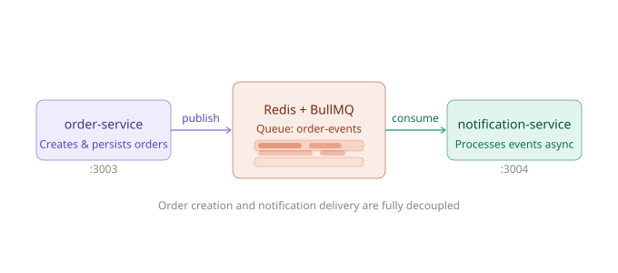
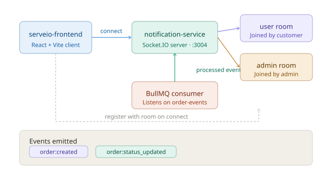

# Serveio

Serveio is a restaurant management platform composed of backend microservices and a React frontend.

## Architecture Overview

The repo is organized as a microservice-based monorepo:

- `users-service/` - user registration, login, profile, and authentication.
- `resturant-service/` - restaurant and menu management.
- `cart-service/` - user cart storage and cart operations.
- `order-service/` - order creation, persistence, and event publishing.
- `notification-service/` - processes order events and sends notifications.
- `serveio-frontend/` - React + Vite frontend for customers.

The root `docker-compose.yml` launches service containers, individual PostgreSQL databases, and a shared Redis instance.

## Communication

The system uses event-driven communication and real-time websockets for notifications:

- `order-service` publishes order events to a Redis-backed BullMQ queue named `order-events`.
- `notification-service` consumes these queued events and processes them independently of the order workflow.
- `notification-service` also exposes a Socket.IO websocket endpoint for frontend clients.
- The frontend opens a websocket connection to `notification-service` and registers with a user or admin room.
- When order events occur, `notification-service` emits real-time events such as `order:created` and `order:status_updated` to connected clients.

This design decouples order creation from notification delivery and enables real-time updates in the browser.

## Data Stores

- `userservice-db` - PostgreSQL for `users-service`
- `restaurantservice-db` - PostgreSQL for `resturant-service`
- `cartservice-db` - PostgreSQL for `cart-service`
- `orderservice-db` - PostgreSQL for `order-service`
- `redis` - shared Redis queue for order event processing

## Queue & WebSocket Architecture

### BullMQ Order Event Queue

The `order-service` publishes order events to a BullMQ queue backed by Redis. The `notification-service` consumes these events independently, fully decoupling order creation from notification delivery.

### WebSocket Real-time Notifications

Clients connect to `notification-service` via Socket.IO and register into a `user` or `admin` room. When the BullMQ consumer processes a queued event, it emits `order:created` or `order:status_updated` to the appropriate room in real time.